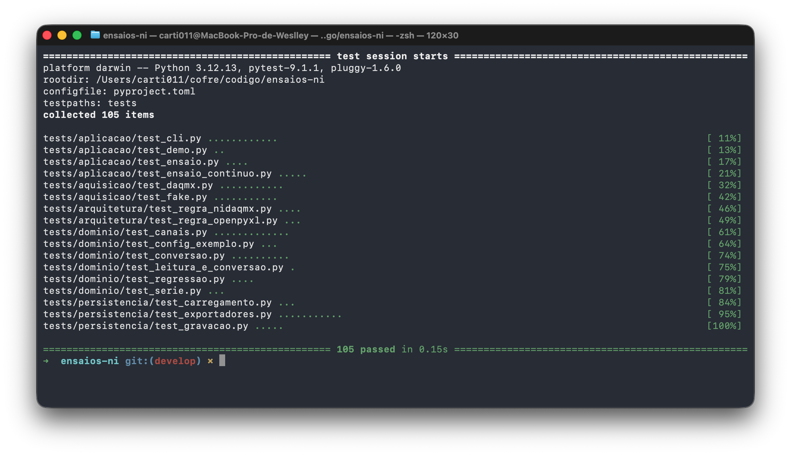
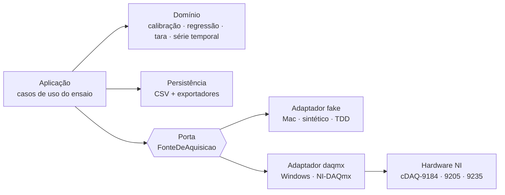

# ensaios-ni

Aquisição de dados para hardware **National Instruments** em Python, no lugar do software de
instrumentação pago.


Laboratórios de ensaio de estruturas medem carga, deformação e vibração com módulos da National
Instruments. O hardware funciona com um driver gratuito (NI-DAQmx); o que se paga é a camada de
aplicação por cima — LabVIEW ou FlexLogger, por assinatura. Este projeto reescreve essa camada: lê
os sensores, converte volts em unidade de engenharia por calibração, grava o ensaio e exporta para
Excel e para a ferramenta de análise que o usuário já usa.

Foi construído para um caso real: um engenheiro de instrumentação que faz provas de carga e análise
de vibração em pontes, lajes e peças estruturais, com células de carga e extensômetros que ele
mesmo calibra.



> Os 105 testes rodam no Mac em frações de segundo, **sem o hardware NI conectado** — efeito direto
> da arquitetura porta/adaptador descrita abaixo.

## Arquitetura

O driver da NI só existe em Windows e Linux x86, não em macOS nem ARM. Para não amarrar o projeto a
um PC Windows, a aquisição fica atrás de uma porta (interface) com dois adaptadores: um real sobre o
`nidaqmx` e um sintético que roda em qualquer máquina. Conversão, calibração e persistência dependem
só da porta, então quase todo o código é desenvolvido e testado no Mac, sem o hardware presente.



A decisão e o porquê estão no [ADR-001](docs/adr/001-arquitetura-porta-adaptador.md); as demais, no
[índice de ADRs](docs/adr/README.md).

## Destaques de engenharia

- **Arquitetura hexagonal por necessidade, não por moda.** A restrição de plataforma do driver é o
  que justifica a porta. Sem ela, nada seria testável fora do Windows.
- **A regra de isolamento é verificada por código.** Um teste percorre a AST de cada arquivo e falha
  se algo fora do adaptador real importar `nidaqmx`. Convenção que nada verifica é convenção que se
  quebra.
- **Dependências opcionais de verdade.** `nidaqmx` e `openpyxl` são extras; o pacote importa e os
  105 testes rodam sem nenhum dos dois instalado.
- **Calibração como no laboratório.** A conversão volts → unidade usa regressão linear por mínimos
  quadrados, com a correlação de Pearson do ajuste — o método que o engenheiro já aplica, não uma
  constante chumbada no código.
- **Um erro silencioso que o teste impede.** A leitura de strain do módulo 9235 precisa de
  quarter-bridge, 120 Ω, 2,0 V. Os valores padrão da biblioteca são full-bridge, 350 Ω, 2,5 V, e
  devolveriam um número plausível e errado sem lançar exceção. Um teste trava a configuração certa.
- **Config-driven.** Medir um prédio, uma ponte ou uma peça é o mesmo programa lendo um
  `config/canais.toml` diferente.

## Stack

- **Python 3.12**, gerenciado com [uv](https://docs.astral.sh/uv/).
- **pytest** para o TDD (domínio e adaptador fake, sem hardware).
- **NI-DAQmx** (driver gratuito) pelo pacote `nidaqmx`, como dependência opcional.
- **tomllib** para configuração; **openpyxl** (opcional) para exportar `.xlsx`.
- Dashboard em **PyQt6/pyqtgraph** na próxima fase ([ADR-013](docs/adr/013-stack-do-dashboard.md)).

## Como rodar

Os testes do domínio e a demonstração rodam em qualquer plataforma, sem hardware:

```bash
uv run pytest                              # 105 testes
PYTHONPATH=src uv run python -m ensaios_ni # ensaio sintético ponta a ponta, gera um CSV
```

Aquisição real no Windows, exportação para Excel/análise e configuração de canais estão no
**[guia de uso](docs/uso.md)**.

## Documentação

- [docs/uso.md](docs/uso.md) — instalar, rodar um ensaio, exportar.
- [docs/adr/README.md](docs/adr/README.md) — índice das decisões de arquitetura (14 ADRs).
- [docs/roadmap.md](docs/roadmap.md) — plano em fases e estado atual.
- [CONTEXT.md](CONTEXT.md) — glossário do domínio (tensão, strain, aferição, tara…).
- [docs/contexto-hardware.md](docs/contexto-hardware.md) — inventário do hardware e a API do
  `nidaqmx` usada.

## Status

Backend completo: leitura (tensão e strain, finita e contínua), calibração, gravação CSV e
exportadores, validados no Windows com dispositivos simulados. A próxima fase é o dashboard. Plano e
detalhes no [roadmap](docs/roadmap.md).

## Estrutura

```text
ensaios-ni/
├── config/
│   └── canais.exemplo.toml      # modelo do mapeamento canal → conversão
├── docs/                        # uso, ADRs, contexto de hardware, roadmap
├── src/ensaios_ni/
│   ├── dominio/                 # Canal, conversão (regressão/segmento/linear), tara, série temporal
│   ├── aquisicao/               # porta + adaptadores (fake / daqmx: tensão e strain)
│   ├── persistencia/            # CSV (gravar/carregar) + exportadores (csv-excel-br, xlsx, txt)
│   ├── aplicacao/               # casos de uso (ensaio finito/contínuo) + demonstração
│   └── __main__.py              # CLI (--fonte, --continuo, --exportar…)
└── tests/                       # dominio · aquisicao · aplicacao · persistencia · arquitetura
```

## Licença

[MIT](LICENSE) — © 2026 Weslley Cardoso.
