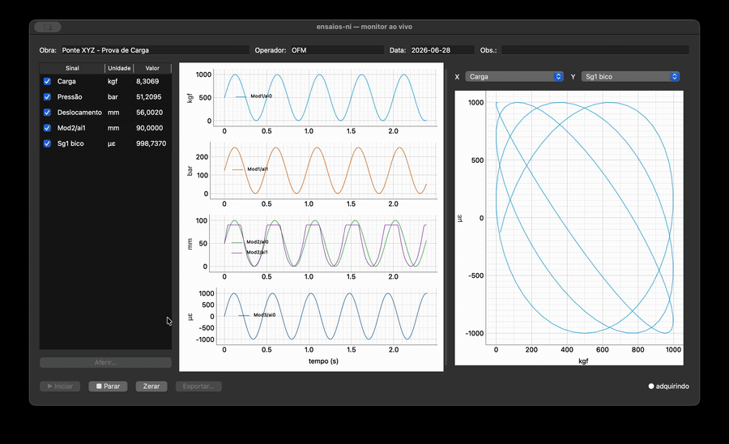
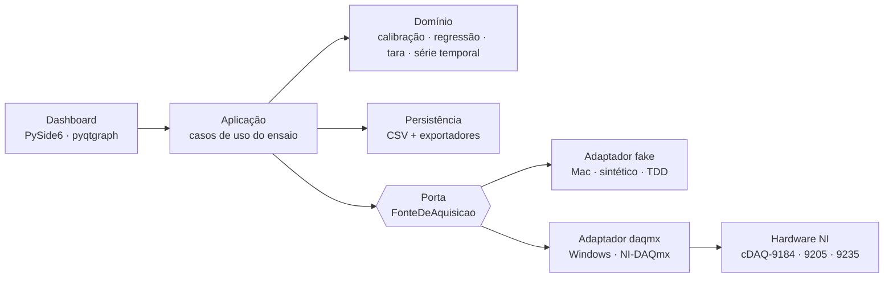
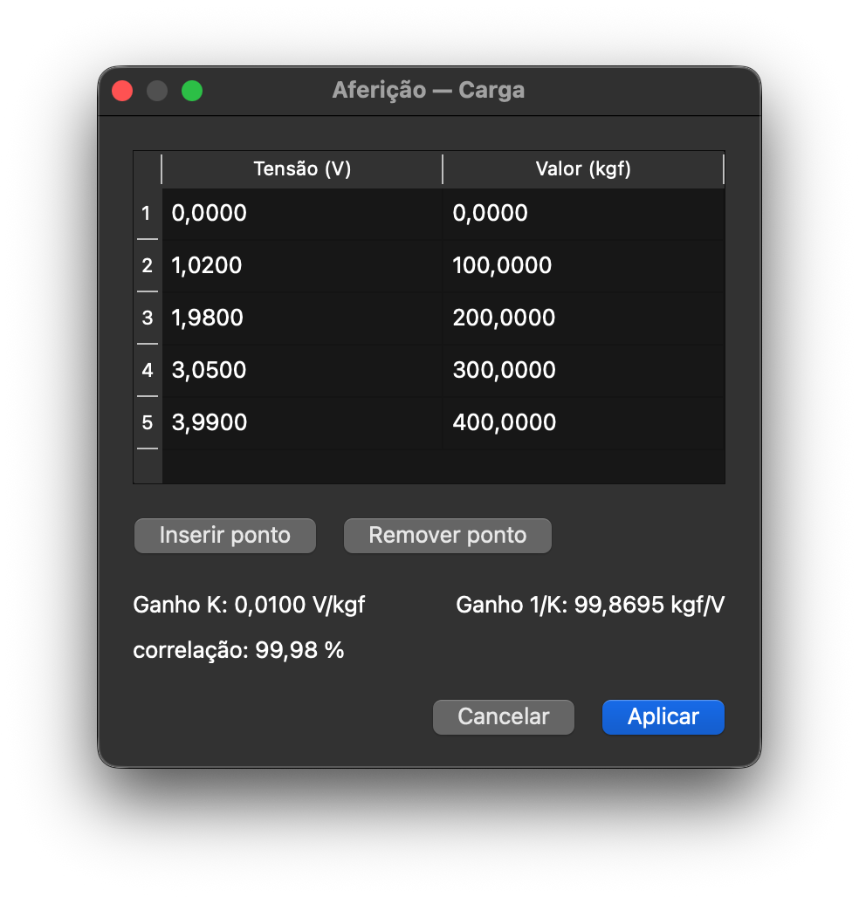
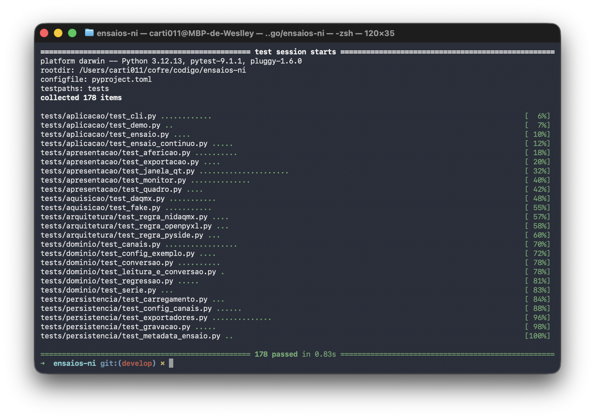

# ensaios-ni

Aquisição de dados para hardware **National Instruments** em Python, no lugar do software de
instrumentação pago.


## O problema

Laboratórios de ensaio medem carga, deformação e vibração com módulos da National Instruments. O
hardware funciona com um driver **gratuito** (NI-DAQmx) — o que se paga é a camada de aplicação por
cima, o LabVIEW ou o FlexLogger, por **assinatura**. Para um engenheiro autônomo que já tem o
hardware, essa licença recorrente é o único custo entre ele e os próprios ensaios.

## A solução

Reescrever **só essa camada** em Python: ler os sensores, converter volts em unidade de engenharia
por calibração, gravar o ensaio, mostrar o sinal ao vivo e exportar para Excel e para a ferramenta
de análise que o engenheiro já domina. O driver gratuito continua acessando o hardware; o que sai é
a assinatura.

Construído para um caso real — provas de carga e análise de vibração em pontes, lajes e peças
estruturais, com células de carga e extensômetros que o próprio usuário calibra.
**Projeto solo:** arquitetura, backend, dashboard e documentação.



> O dashboard **ao vivo** durante um ensaio: canais à esquerda (com **Nome do Sinal** e valor
> atualizando), sinal×tempo **empilhado por unidade**, **XY carga × deformação** evoluindo à direita
> e o controle do ensaio no rodapé. Roda no Mac com o adaptador sintético, **sem o hardware NI
> conectado**.

## Arquitetura

O driver da NI só existe em Windows e Linux x86, não em macOS nem ARM. Para não amarrar o projeto a
um PC Windows, a aquisição fica atrás de uma porta (interface) com dois adaptadores: um real sobre o
`nidaqmx` e um sintético que roda em qualquer máquina. Conversão, calibração, persistência e
dashboard dependem só da porta, então quase todo o código é desenvolvido e testado no Mac, sem o
hardware presente — os 178 testes rodam em menos de um segundo.



A decisão e o porquê estão no [ADR-001](docs/adr/001-arquitetura-porta-adaptador.md); as demais, no
[índice de ADRs](docs/adr/README.md).

## Destaques de engenharia

- **Arquitetura hexagonal por necessidade, não por moda.** A restrição de plataforma do driver é o
  que justifica a porta. Sem ela, nada seria testável fora do Windows.
- **A regra de isolamento é verificada por código.** Um teste percorre a AST de cada arquivo e falha
  se algo fora do adaptador real importar `nidaqmx` (e o mesmo vale para `PySide6` e `openpyxl`).
  Convenção que nada verifica é convenção que se quebra.
- **Dependências opcionais de verdade.** `nidaqmx`, `openpyxl` e a GUI (`PySide6`/`pyqtgraph`) são
  extras; o pacote importa e os 178 testes rodam sem nenhum deles instalado.
- **Calibração como no laboratório.** A conversão volts → unidade usa regressão linear por mínimos
  quadrados, com a correlação de Pearson do ajuste — o método que o engenheiro já aplica, não uma
  constante chumbada no código.
- **Um erro silencioso que o teste impede.** A leitura de strain do módulo 9235 precisa de
  quarter-bridge, 120 Ω, 2,0 V. Os valores padrão da biblioteca são full-bridge, 350 Ω, 2,5 V, e
  devolveriam um número plausível e errado sem lançar exceção. Um teste trava a configuração certa.
- **Tempo real sem travar a UI.** O dashboard separa um Presenter Python puro (testável no Mac, sem
  display) de um widget PySide6 fino — a lógica de janela deslizante, empilhamento e XY é testada
  sem abrir tela.
- **Config-driven.** Medir um prédio, uma ponte ou uma peça é o mesmo programa lendo um
  `config/canais.toml` diferente.



> Aferição de um canal por **regressão linear**, espelhando o fluxo do AqDados: a tabela de pontos
> (tensão → valor de engenharia), o ganho da reta (V/un e un/V) e a **correlação** do ajuste — a
> calibração de laboratório, na tela.

## Stack

- **Python 3.12**, gerenciado com [uv](https://docs.astral.sh/uv/).
- **pytest** para o TDD (domínio, persistência e Presenters — sem hardware nem display).
- **NI-DAQmx** (driver gratuito) pelo pacote `nidaqmx`, como dependência opcional.
- **tomlkit** para ler e escrever a configuração; **openpyxl** (opcional) para exportar `.xlsx`.
- **PySide6 + pyqtgraph** (opcional) no dashboard desktop — desktop nativo, tempo real, empacotável
  em `.exe` ([ADR-013](docs/adr/013-stack-do-dashboard.md), [ADR-015](docs/adr/015-ux-e-fluxo-do-dashboard.md)).

## Como rodar

Os testes, a demonstração por CLI e o dashboard rodam em qualquer plataforma, sem hardware:

```bash
uv run pytest                                              # 178 testes
PYTHONPATH=src uv run python -m ensaios_ni                 # ensaio sintético ponta a ponta, gera um CSV
PYTHONPATH=src uv run python -m ensaios_ni.apresentacao.qt.janela  # abre o dashboard com o adaptador fake
```



Aquisição real no Windows, exportação para Excel/análise e configuração de canais estão no
**[guia de uso](docs/uso.md)**; a validação no hardware físico, no
**[guia de teste em hardware](docs/guia-teste-hardware.md)**.

## Documentação

- [docs/uso.md](docs/uso.md) — instalar, rodar um ensaio, exportar.
- [docs/guia-teste-hardware.md](docs/guia-teste-hardware.md) — validar no hardware real, do ambiente
  ao ensaio.
- [docs/adr/README.md](docs/adr/README.md) — índice das decisões de arquitetura (18 ADRs).
- [docs/roadmap.md](docs/roadmap.md) — plano em fases e estado atual.
- [CONTEXT.md](CONTEXT.md) — glossário do domínio (tensão, strain, aferição, tara…).
- [docs/contexto-hardware.md](docs/contexto-hardware.md) — inventário do hardware e a API do
  `nidaqmx` usada.

## Status e próximos passos

Backend e dashboard completos e testados — leitura de tensão e strain (finita e contínua),
calibração, gravação, exportadores e a interface ao vivo —, validados no Windows com dispositivos
simulados e no Mac com o adaptador sintético (178 testes). Os próximos passos são a **validação no
hardware físico** do usuário e o **empacotamento** num executável para distribuição: trabalho de
campo e integração, não de capacidade. Plano completo no [roadmap](docs/roadmap.md).

## Estrutura

```text
ensaios-ni/
├── config/
│   └── canais.exemplo.toml      # modelo do mapeamento canal → conversão
├── docs/                        # uso, ADRs, contexto de hardware, roadmap, guia de teste
├── src/ensaios_ni/
│   ├── dominio/                 # Canal, conversão (regressão/segmento/linear), tara, série temporal, metadata
│   ├── aquisicao/               # porta + adaptadores (fake / daqmx: tensão e strain)
│   ├── persistencia/            # CSV (gravar/carregar) + exportadores (csv-excel-br, xlsx, txt)
│   ├── apresentacao/            # dashboard: Presenters (Python puro) + qt/ (widget PySide6)
│   ├── aplicacao/               # casos de uso (ensaio finito/contínuo) + demonstração
│   └── __main__.py              # CLI (--fonte, --continuo, --exportar…)
└── tests/                       # dominio · aquisicao · aplicacao · persistencia · apresentacao · arquitetura
```

## Licença

[MIT](LICENSE) — © 2026 Weslley Cardoso.
